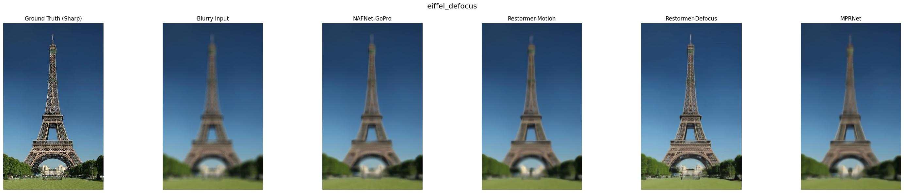
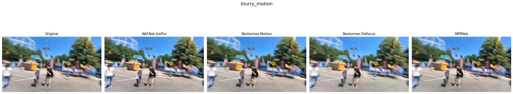
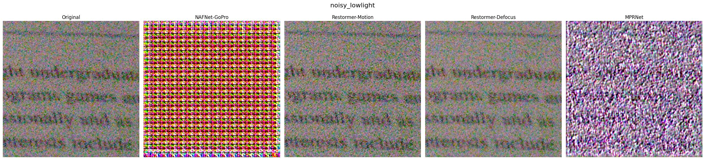

# 🌟 Universal Image Restoration Web Application

[](https://imagerestoration-cjkrj7anevvpkc7tq923s2.streamlit.app/)

A state-of-the-art Deep Learning web application designed to automatically classify, restore, and enhance degraded images. It addresses multiple common image artifacts including **motion blur, defocus blur, camera noise, and low-light degradation** using advanced neural architectures.

🔗 **Live Deployment:** [imagerestoration-cjkrj7anevvpkc7tq923s2.streamlit.app](https://imagerestoration-cjkrj7anevvpkc7tq923s2.streamlit.app/)

---

## 🚀 Key Architectures & Features

The restoration pipeline features three industry-standard deep learning models:
1. **NAFNet (Nonlinear Activation Free Network)**: Optimized for extremely fast and high-quality motion deblurring by removing nonlinear activation layers to simplify computation.
2. **Restormer**: An efficient Transformer-based model designed for high-resolution image restoration (defocus and motion deblurring) utilizing multi-dconv head transposed attention.
3. **MPRNet (Multi-Stage Progressive Restoration)**: A progressive multi-stage model that restores severe/mixed blur and noise in stages to preserve fine-grained structural details.

### 🧠 Automatic Degradation Classifier
The backend features an automatic image analysis algorithm (based on Laplacian variance, Sobel gradients, and polar coordinate histograms) to classify input images and dynamically route them to the most effective model for that specific degradation.

---

## 📸 Before / After Restoration Comparisons

Here are some actual output results processed by the restoration pipeline:

### 1. Defocus Deblurring (Restormer)
Enhances camera focus issues, sharpening the main subject cleanly.


### 2. Motion Deblurring (NAFNet)
Resolves hand-shake or fast-moving subject blur.


### 3. Noise & Low-Light Enhancement
Removes high-frequency camera sensor noise and brings out details in dark areas.


---

## 🛠️ Local Installation & Development

### Prerequisite: Setup Checkpoints
Ensure you have downloaded the `.pth` pre-trained checkpoints and placed them in the `checkpoints/` directory:
- `checkpoints/nafnet_gopro.pth`
- `checkpoints/restormer_motion.pth`
- `checkpoints/restormer_defocus.pth`
- `checkpoints/mprnet_deblurring.pth`

### Option 1: Run Streamlit Web Application
1. Install the required dependencies:
   ```bash
   pip install -r requirements.txt
   ```
2. Launch the Streamlit dashboard:
   ```bash
   streamlit run streamlit_app.py
   ```

### Option 2: Run Full Production Stack (React + FastAPI)
This codebase also includes a custom premium UI built on React (Vite) and a FastAPI backend server.

1. **Start the FastAPI Backend Server:**
   ```bash
   python web_app.py
   ```
2. **Start the React Frontend Dev Server:**
   ```bash
   cd frontend
   npm install
   npm run dev
   ```
